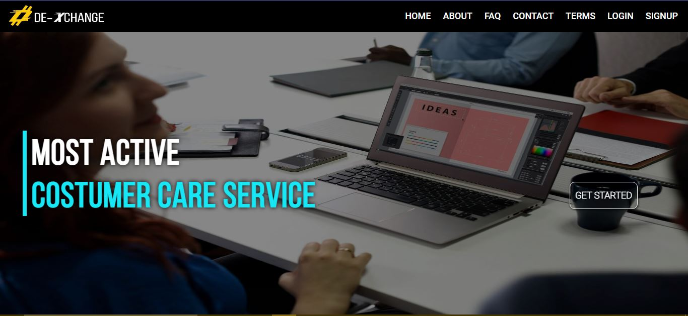

# Dexchange Investment 
A Web Investment Application, Designed with full functionalities (Automated Analyist). 

## Application Features:
-   Automated Data Analysing Function
-   Simple and Clean UI
-   Easy Navigation
-   Works Offline with MySQL Database
-   For Investment Purposes

## Task and How To Use The Application
-   Register as a new user
-   Login to access your account
-   Make a virtual deposit 
-   Add an Address and make a virtual withdrawal of your funds
-   Approve a client's withdrawal request from the "admin" route

**For Offline Purposes**
After cloning the repo to your local computer, install the necessary nodemon dependencies, Create a database (MySQL Database) with the name "dexchange" import the file("dexchange.sql") from the "MySQL-DB" folder inside "Public". change the "Conn.js" to that of your local computer username and password.

Start the App with "npm start" on the CLT

## License
[LDC](LICENSE.md)
